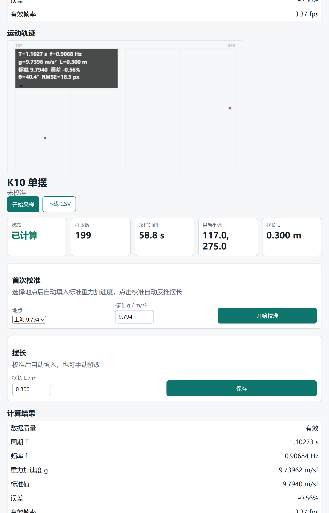

# K10 单摆实验

UNIHIKER K10 + HUSKYLENS 2 自动完成单摆实验

：HUSKYLENS 用颜色识别追踪摆球，K10 通过 I2C 读取坐标，2D 椭圆拟合计算频率和重力加速度 g。无需 TF 卡，不保存图片。

## 硬件连接

```
HUSKYLENS 2 Gravity 4Pin → K10 I2C/Gravity 口
VCC  → VCC
GND  → GND
SDA  → SDA
SCL  → SCL
```

HUSKYLENS 2 设为 I2C 协议，进入 Color Recognition 模式，学习摆球颜色（默认 ID 1）。

## 快速开始

### 1. 烧录前设置

打开 `src/main.cpp`，修改顶部常量：

```cpp
constexpr int kPivotX = 160;           // 悬点在 HUSKYLENS 画面中的 x 坐标
constexpr int kPivotY = 24;            // 悬点在 HUSKYLENS 画面中的 y 坐标
constexpr uint16_t kTargetId = 1;      // 摆球颜色 ID
constexpr uint16_t kIgnoreFrameId = 2; // 背景/大框颜色 ID（可忽略）
```

### 2. 首次 USB 烧录

必须 USB 烧录一次以写入 OTA 分区表：

```bash
pio run -t upload -e unihiker
```

### 3. 连接 K10

- K10 建立 WiFi AP：`k10-pendulum`，密码 `12345678`
- 浏览器打开 `http://192.168.4.1/`
- K10 同时尝试连接局域网 WiFi（默认 SSID `DFRobot-guest`），成功后网页显示局域网 IP

### 4. 首次校准

1. 网页显示"未校准"状态，选择地点（上海/北京/广州/自定义）
2. 输入或确认标准重力加速度 g 值
3. 点击 **"开始校准"**，摆起单摆
4. 60 秒后自动停止，反推摆长 L 并保存
5. 状态变为"已校准"

### 5. 测量

点击 **"开始采样"**，摆起单摆，60 秒自动停止，屏幕上显示 g 值及误差百分比。

后续可通过 OTA 无线更新固件，无需再次 USB 连接。

## 网页功能

- **运动轨迹**：XY 散点图，蓝色→红色渐变，显示摆球完整运动路径，红色十字标悬点
- **计算结果**：周期 T、频率 f、重力加速度 g、标准值对比、误差百分比、有效帧率
- **最近样本**：最新 3 条采样数据
- **摆长管理**：校准后自动填入，可手动修改
- **配网**：修改局域网 WiFi 并保存
- **OTA 更新**：上传新固件无线更新
- **下载 CSV**：导出完整采样数据

## 算法说明

### 2D 椭圆拟合

```
x(t) = x₀ + aₓcos(ωt) + bₓsin(ωt)
y(t) = y₀ + aᵧcos(ωt) + bᵧsin(ωt)
```

在合理 g 对应的频率范围内搜索最小二维残差频率，适配摄像头视角造成的椭圆投影。

### 重力加速度

校准模式下反推摆长：`L = g₀ / (2πf)²`

测量模式下计算重力加速度：`g = (2πf)² × L`

### 数据质量

自动检测：采样时长不足、拟合误差过大、g 超出合理范围等，给出质量标记。

## OTA 无线更新

首次 USB 烧录后，后续可通过 WiFi 更新：

```bash
# 编译
pio run -e unihiker

# OTA 上传（替换为实际 IP）
curl -F "firmware=@.pio/build/unihiker/firmware.bin" http://192.168.x.x/ota
```

也可在网页的 OTA 表单直接上传。

分区表 `partitions.csv` 保留了 K10 AI 模型区域（`0x510000` 起），不影响语音识别等功能。

## 注意事项

- 摆角建议 < 20°，以保证小角度近似的准确性
- g 的准确度主要取决于校准得到的摆长和频率测量精度
- 摄像头透视畸变会导致像素计算的摆角偏大，算法已忽略该值
- K10 屏幕显示 `I2C:check` 时检查 HUSKYLENS 连接
- 样本数不增长通常是 HUSKYLENS 没看到已学颜色，重新学习或调整光照
- 网页自动每 60 秒停止采样，kMaxSamples=200 作为备选停止条件

## 可选：电脑端复核

`tools/analyze_pendulum.py` 可用于视频或图片序列独立复核结果。

```bash
pip install -r requirements.txt
python tools/analyze_pendulum.py --video 单摆实验_测重力加速度.mp4 --color red
```
